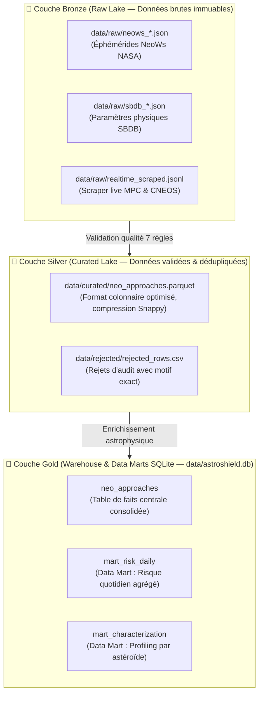
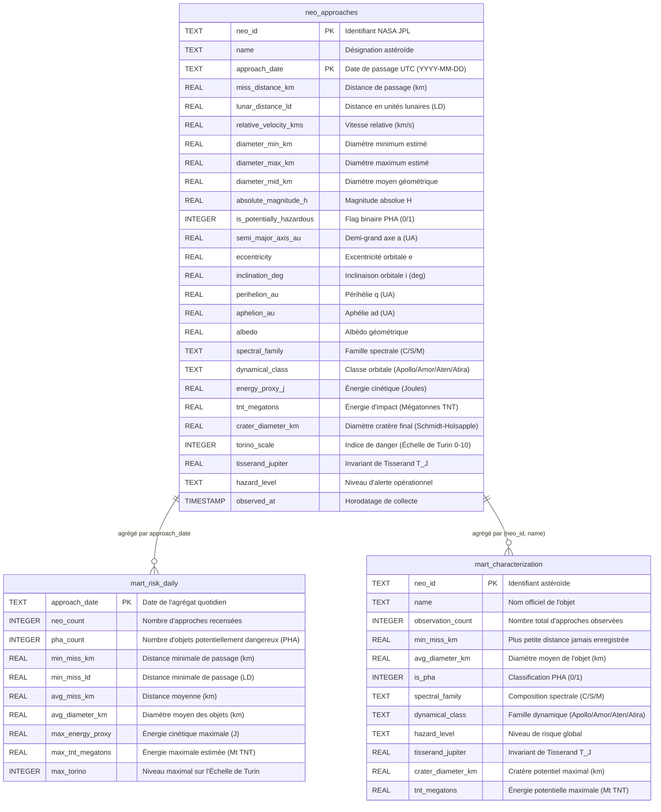

# ☄️ AstroShield — Observatoire des objets géocroiseurs (NEO)

Pipeline de collecte, de validation qualité, d'entreposage et d'analyse prédictive des astéroïdes géocroiseurs (*Near-Earth Objects*), conçu dans le cadre du module **Architectures BD et collecte de données** (ESEO).

> **Question centrale** : Quels astéroïdes géocroiseurs représentent le risque d'impact le plus significatif pour la Terre, et comment leur caractérisation orbitale et physique permet-elle d'anticiper les menaces ?

---

## 🎯 Utilisateur et décisions métier

| Élément | Description |
|---|---|
| **Utilisateur cible** | Bureau de défense planétaire (rôle de planétologue / analyste de risque) |
| **Décisions métier** | Prioriser les objets PHA (*Potentially Hazardous Asteroids*) à fort potentiel de danger ; imputer les diamètres physiques inconnus ; repérer les orbites atypiques ou déviantes |
| **Périmètre** | Astéroïdes géocroiseurs (`périhélie < 1,3 UA`), trajectoires et approches terrestres |
| **Fréquence** | Batch quotidien (NeoWs) + enrichissement orbital (SBDB) + flux télescope simulé (séance 3) |

### Cas d'usage et KPI associés

| # | Cas d'usage | KPI surveillés | Données sources | Fréquence |
|---|---|---|---|---|
| **1** | **Veille du risque d'impact** | Nombre de PHA / jour, distance minimale de passage, énergie cinétique estimée | Éphémérides NeoWs, vitesses, diamètres | Quotidienne |
| **2** | **Caractérisation physique** | Répartition des familles spectrales (C/S/M), taux d'imputation des diamètres | Magnitude $H$, albédo, diamètre | Hebdomadaire |
| **3** | **Détection d'anomalies** | Nombre d'orbites déviantes détectées (Isolation Forest) | Demi-grand axe $a$, excentricité $e$, inclinaison $i$ | Quotidienne |

---

## 🛰️ Sources de données

| Critère | Source A (Principale) | Source B (Enrichissement) |
|---|---|---|
| **Producteur** | NASA JPL — NeoWs | NASA JPL — Small-Body Database (SBDB) |
| **URL API** | `https://api.nasa.gov/neo/rest/v1/feed` | `https://ssd-api.jpl.nasa.gov/sbdb.api` |
| **Mode d'accès** | API REST, clé gratuite (`DEMO_KEY` par défaut ou `NASA_API_KEY`) | API REST publique, sans clé requise |
| **Format** | JSON (fenêtre de 7 jours max par requête) | JSON (paramètres physiques et orbitaux) |
| **Mise à jour** | Quotidienne | Continue |
| **Clé de jointure** | `neo_reference_id` | `spkid` / désignation normalisée |
| **Licence** | Données publiques NASA | Données publiques JPL |
| **Données personnelles** | Aucune (astronomie fondamentale) | Aucune |

Détails complets d'évaluation dans [docs/source_assessment.md](docs/source_assessment.md).

---

## 📐 Grain et clé métier

**Une observation représente une approche rapprochée (*close approach*) d'un astéroïde géocroiseur vers la Terre à une date donnée.**  
Clé métier naturelle : `(neo_id, approach_date)`.

| Champ | Type | Obligatoire | Description / Source |
|---|---|:---:|---|
| `neo_id` | `string` | ✔ | Identifiant pérenne JPL (`neo_reference_id`) |
| `name` | `string` | | Désignation provisoire ou nom officiel |
| `approach_date` | `date (UTC)` | ✔ | Date de l'approche normalisée en UTC (`YYYY-MM-DD`) |
| `miss_distance_km` | `float` | ✔ | Distance de passage à la Terre en km |
| `lunar_distance_ld` | `float` | | Distance exprimée en Distances Lunaires ($1\text{ LD} = 384\,400\text{ km}$) |
| `relative_velocity_kms` | `float` | | Vitesse relative lors du passage (km/s) |
| `diameter_min/max/mid_km` | `float` | | Diamètre géométrique estimé (km) |
| `absolute_magnitude_h` | `float` | | Magnitude absolue $H$ (luminosité intrinsèque) |
| `is_potentially_hazardous`| `bool / int` | | Classification PHA par le JPL |
| `semi_major_axis_au` | `float` | | Demi-grand axe $a$ en UA (Source B SBDB) |
| `eccentricity` | `float` | | Excentricité orbitale $e$ (Source B SBDB) |
| `inclination_deg` | `float` | | Inclinaison orbitale $i$ en degrés (Source B SBDB) |
| `perihelion_au` / `aphelion_au` | `float` | | Périhélie $q$ et aphélie $ad$ ($q < ad$) |
| `albedo` | `float` | | Albédo géométrique de surface (Source B SBDB) |
| `spectral_family` | `string` | | Famille spectrale : C (carbonée), S (silicatée), M (métallique) |
| `dynamical_class` | `string` | | Classe dynamique : Apollo, Amor, Aten, Atira |
| `tisserand_jupiter` | `float` | | Invariant de Tisserand par rapport à Jupiter ($T_J$) |
| `energy_proxy_j` | `float` | | Énergie cinétique d'impact $\frac{1}{2} m v^2$ (Joules) |
| `tnt_megatons` | `float` | | Équivalent explosif en Mégatonnes de TNT ($1\text{ Mt} = 4{,}184 \times 10^{15}\text{ J}$) |
| `crater_diameter_km` | `float` | | Diamètre théorique de cratère (loi de Schmidt-Holsapple) |
| `torino_scale` | `int` | | Échelon sur l'Échelle de Turin (0 à 10) |
| `hazard_level` | `string` | | Niveau de criticité opérationnelle |
| `observed_at` | `datetime (UTC)`| ✔ | Horodatage de la collecte (traçabilité) |

---

## 🏗️ Architecture du pipeline

```
[NASA NeoWs API] ──batch quotidien──▶ data/raw/neows_*.json (zone brute horodatée)
[JPL SBDB API]   ──enrichissement──▶ data/raw/sbdb_*.json   │
[Flux télescope] ──streaming simulé─▶ data/raw/*.jsonl      │
                                                            ▼
                                          src/validate.py (7 règles du contrat)
                                                            │
                     ┌──────────────────────────────────────┼──────────────────────────────────────┐
                     ▼                                      ▼                                      ▼
             data/rejected/                         Zone Lake Parquet                     Warehouse SQLite
           rejected_rows.csv                         (zone rejouable)                   (UPSERT clé métier)
       (cause exacte du rejet)                              │                                      │
                                                            │                         Data Marts Gold :
                                                            │                         - mart_risk_daily
                                                            │                         - mart_characterization
                                                            ▼                                      │
                                        ┌──────────────────────────────────────────────────────────┴─────┐
                                        ▼                                                                ▼
                             Streamlit Dashboard                                                 Modèles Machine Learning
                         (monitoring & simulation)                                        - Random Forest (PHA Baseline)
                                                                                          - Gradient Boosting (Diamètre)
                                                                                          - Isolation Forest (Anomalies)
                                                                                          - PyTorch LSTM (Séquences)
```

---

## 🗄️ Architecture & Modélisation de la Base de Données

AstroShield repose sur une architecture moderne de type **Lakehouse (Médaillon Bronze / Silver / Gold)** conçue pour garantir la traçabilité intégrale, la rejouabilité mathématique et la performance analytique haute cadence :

### 1. Organisation des couches de données (Médaillon)



- **Bronze (Zone brute)** : Stockage append-only des flux JSON/JSONL horodatés sans altération.
- **Silver (Zone Lake)** : Format Parquet colonnaire (`data/curated/neo_approaches.parquet`). Très forte compression (ratio x3 à x5 vs CSV), typage strict, idéal pour l'entraînement des modèles ML et la rejouabilité historique.
- **Gold (Warehouse relationnel)** : Base SQLite [data/astroshield.db](file:///d:/5IA/DB/astroshield/data/astroshield.db) servant l'analytique temps réel, les tableaux de bord et l'API WebSocket.

---

### 2. Schéma relationnel du Warehouse (`data/astroshield.db`)



---

### 3. Dictionnaire détaillé des tables

#### Table Centrale : `neo_approaches`
- **Grain** : 1 ligne = 1 approche orbitale d'un astéroïde à une date donnée.
- **Clé métier primaire** : `(neo_id, approach_date)`.
- **Index unique d'idempotence** :
  ```sql
  CREATE UNIQUE INDEX IF NOT EXISTS uq_neo_approach 
  ON neo_approaches(neo_id, approach_date);
  ```
- **Rôle** : Table de référence consolidant données orbitales, observationnelles et métriques physiques dérivées (Schmidt-Holsapple, Turin).

#### Data Mart 1 : `mart_risk_daily` (Veille d'Impact)
- **Grain** : 1 ligne = 1 journée d'observations (`approach_date`).
- **Rôle** : Sert directement les KPI du tableau de bord et les alertes opérationnelles (identification des pics de PHA, distance minimale en LD, énergie maximale libérable).

#### Data Mart 2 : `mart_characterization` (Caractérisation Physique & Dynamique)
- **Grain** : 1 ligne = 1 astéroïde unique (`neo_id, name`).
- **Rôle** : Analyse de fond pour les planétologues : répartition par familles spectrales (carbonée, silicatée, métallique), classes dynamiques képlériennes et historique cumulé des passages.

---

### 4. Requêtes SQL types pour l'analyse métier

```sql
-- 1. Top 5 des astéroïdes les plus dangereux passés à proximité immédiate (< 5 LD)
SELECT name, approach_date, lunar_distance_ld, relative_velocity_kms,
       diameter_mid_km, tnt_megatons, crater_diameter_km, torino_scale
FROM neo_approaches
WHERE lunar_distance_ld < 5.0
ORDER BY tnt_megatons DESC
LIMIT 5;

-- 2. Synthèse quotidienne des journées à haut risque (PHA >= 1 ou Turin >= 2)
SELECT approach_date, neo_count, pha_count, min_miss_ld, max_tnt_megatons, max_torino
FROM mart_risk_daily
WHERE pha_count > 0 OR max_torino >= 2
ORDER BY min_miss_ld ASC;

-- 3. Répartition spectrale et risque moyen par classe dynamique
SELECT dynamical_class, spectral_family, COUNT(*) AS count_neo,
       ROUND(AVG(avg_diameter_km), 3) AS mean_diameter_km,
       SUM(is_pha) AS total_pha
FROM mart_characterization
WHERE dynamical_class IS NOT NULL
GROUP BY dynamical_class, spectral_family
ORDER BY total_pha DESC;
```

---


## 🛡️ Règles de qualité et contrat de données (`config/data_contract.yaml`)

Le pipeline applique le principe strict de **non-suppression silencieuse** : chaque ligne en entrée est soit acceptée, soit dédupliquée, soit rejetée avec le libellé précis des règles enfreintes.

$$\text{input\_rows} = \text{accepted\_rows} + \text{rejected\_rows} + \text{duplicates\_removed}$$

| # | Règle du contrat | Condition technique | Action |
|---|---|---|---|
| **1** | **Complétude clé** | `neo_id` et `approach_date` renseignés et non vides | Rejet immédiat |
| **2** | **Validité temporelle** | `approach_date` convertible en date UTC valide | Rejet immédiat |
| **3** | **Domaine distance** | `miss_distance_km` $\in [1{,}0 \text{ km} \,;\, 74\,800\,000 \text{ km}]$ ($0{,}5 \text{ UA}$) | Rejet immédiat |
| **4** | **Domaine diamètre** | Si renseigné, `diameter_mid_km` $\in [0{,}001 \text{ km} \,;\, 1000 \text{ km}]$ | Rejet immédiat |
| **5** | **Domaine magnitude** | Si renseignée, magnitude absolue $H \in [-2{,}0 \,;\, 35{,}0]$ | Rejet immédiat |
| **6** | **Unicité clé métier** | Doublons sur la clé `(neo_id, approach_date)` | Déduplication et comptage au rapport |
| **7** | **Fraîcheur de collecte**| Horodatage `observed_at` âgé de moins de 48 h | Avertissement (*Warning*, sans rejet) |

Les rejets sont tracés dans [data/rejected/rejected_rows.csv](data/rejected/rejected_rows.csv) avec la colonne `reject_reason` (ex: `completeness_key;valid_date;domain_miss_distance`).

---

## ⚙️ Installation et prise en main

### 1. Environnement virtuel et dépendances

```bash
# Création et activation de l'environnement virtuel
python -m venv .venv
# Sur Linux / macOS :
source .venv/bin/activate
# Sur Windows :
.venv\Scripts\activate

# Installation des dépendances
pip install -r requirements.txt
```

### 2. Modes d'exécution du pipeline

```bash
# 1. Démo complète hors-ligne (génère un jeu synthétique cohérent NeoWs + SBDB, exécute le pipeline et entraîne les 3 modèles ML) :
python -m src.pipeline --synthetic

# 2. Rejeu de la zone brute locale (idempotence) :
python -m src.pipeline --offline

# 3. Démonstration explicite d'un rejet qualité (injecte une ligne volontairement invalide) :
python -m src.pipeline --offline --inject-error

# 4. Mode live avec les API officielles NASA & JPL (clé optionnelle via NASA_API_KEY) :
python -m src.pipeline --live --start 2026-09-01 --end 2026-09-30 --enrich-sbdb

# 5. Simulation d'un flux d'événements télescope (streaming JSON Lines) :
python -m src.pipeline --synthetic --stream
```

### 3. Diffusion temps réel (WebSockets) et Scraping en direct (MPC & NASA CNEOS)

Le projet intègre une double architecture de flux temps réel :
1. **Serveur WebSocket haute fréquence** pour diffuser les alertes d'impact (< 5 secondes).
2. **Scraper temps réel** qui interroge en direct le *Minor Planet Center* (IAU NEOCP) pour capter les astéroïdes découverts par les télescopes optiques mondiaux *aujourd'hui*, ainsi que les approches imminentes NASA CNEOS :

```bash
# A. Lancer le Scraper Temps Réel (interroge MPC NEOCP + CNEOS et diffuse sur WebSocket) :
python -m src.realtime_scraper --poll-interval 15.0 --push-ws

# B. Lancer le serveur WebSocket de streaming (écoute sur ws://127.0.0.1:8765) :
python -m src.stream_server --port 8765 --interval 2.0

# C. Lancer le consommateur d'alerte en direct :
python -m src.stream_consumer --url ws://127.0.0.1:8765 --max-events 15
```

### 4. Exécution des tests automatisés

La suite de 16 tests unitaires et d'intégration valide le contrat, les transformations, les modèles ML, l'idempotence, les WebSockets et le Scraper temps réel :

```bash
pytest tests/
```

### 5. Lancement du Dashboard Temps Réel & Scraper Autonome (SANS STREAMLIT)

AstroShield intègre désormais une **station de commandement opérationnelle avancée** (HTML5, Vanilla CSS, Vanilla JS, WebSockets et Canvas 2D) propulsée par un serveur haute performance Starlette / Uvicorn :

> **Zéro bouton requis** : Le scraper d'arrière-plan s'active automatiquement dès le démarrage du serveur. Il interroge continuellement en direct le **Minor Planet Center de l'IAU (NEOCP)** et les approches réelles de la **NASA JPL CNEOS**, et pousse instantanément les découvertes vers l'interface via WebSocket.

```bash
# Lancement de la station de commandement (Web + WebSocket + Scraper autonome) :
python -m src.live_server
```

Ouvrez ensuite votre navigateur sur **`http://127.0.0.1:8000`** :
- **Intégration du Blason Officiel** : Logo mission haute résolution (`logos/LOGO.jpg`) affiché avec halo néon.
- **Radar Spatial Géocentrique 60 FPS** : Faisceau radar rotatif en temps réel, anneau de la Lune ($1.0\text{ LD}$), zone de vigilance ($5.0\text{ LD}$) et frontière critique PHA ($19.5\text{ LD}$).
- **Verrouillage Tactique de Cible** : Clic ou survol sur n'importe quel astéroïde du radar pour afficher sa fiche télémétrique complète.
- **Simulateur d'Impact Schmidt-Holsapple** : Calcul instantané de l'énergie en Mégatonnes de TNT, comparaison historique (Hiroshima, Tsar Bomba, Chicxulub), diamètre de cratère final, magnitude sismique sur l'échelle de Richter et rayon de souffle.
- **Terminal Télémesure & Scraper Live** : Flux textuel de toutes les détections IAU et NASA en direct.
- **Système d'Alerte Acoustique (Web Audio API)** : Synthèse sonore de bips radar et sirène d'alerte planétaire sur menaces critiques (sans dépendance de fichiers audio externes).
- **Matrice Échelle de Turin** : Jauge internationale graduée de 0 à 10 avec code couleur dynamique.

---

### 6. Dashboard Historique Streamlit (Optionnel)

Pour explorer l'analyse exploratoire et les modèles ML en mode classique :

```bash
streamlit run src/dashboard.py
```
Le tableau de bord propose 5 onglets opérationnels :
- **Bandeau de monitoring qualité & santé** : Taux de complétude, ratio de rejets, score de santé des données en direct.
- **Onglet 1 — Veille risque & Alerte** : Volume d'approches, surveillance des PHA, distances minimales en Distances Lunaires (LD) et énergie maximale en Mégatonnes de TNT.
- **Onglet 2 — Caractérisation & Dynamique** : Répartition par classes dynamiques (Apollo, Amor, Aten, Atira), familles spectrales (C/S/M), niveaux de criticité opérationnelle et dispersion orbitale.
- **Onglet 3 — Simulateur d'impact & Cratère terrestre** : Calculateur d'impact cinétique basé sur les lois de Schmidt-Holsapple.
- **Onglet 4 — Modèles Machine Learning** : Analyse d'importance des variables (Random Forest), simulateur interactif d'imputation de diamètre (Gradient Boosting), et bilan d'anomalies orbitales (Isolation Forest).
- **Onglet 5 — Flux Live & WebSockets** : Réception télémétrique en direct depuis le serveur WebSocket.


---

## 🤖 Modèles de Machine Learning & Deep Learning

| Modèle | Rôle métier | Données d'entrée | Sortie / Métrique |
|---|---|---|---|
| **Random Forest** (Pipeline + `StandardScaler`) | Classification du statut PHA (Baseline de référence) | $H$, distance, vitesse, diamètre, $a$, $e$, $i$ | $F_1\text{-score}$, Recall sur la classe dangereuse |
| **Gradient Boosting** | Imputation du diamètre physique inconnu (seuls ~10 % sont mesurés) | Magnitude $H$, Albédo | $R^2$, MAE (km) |
| **Isolation Forest** | Détection d'orbites atypiques ou déviantes | Paramètres képlériens $a$, $e$, $i$, magnitude $H$ | Contamination 5 %, nombre d'anomalies |
| **LSTM PyTorch** (*Bonus DL*) | Prédiction de la distance de passage suivante par astéroïde | Séries temporelles de passages successifs | MSE d'entraînement (dégradation gracieuse si non installé) |

---

## 🔁 Idempotence et conservation des données

1. **Clé métier unifiée** : `(neo_id, approach_date)` garantit l'unicité à la fois dans le fichier Parquet du Lake et dans le warehouse SQLite via `CREATE UNIQUE INDEX IF NOT EXISTS uq_neo_approach`.
2. **Rejouabilité totale** : Toutes les données brutes sont conservées sans altération dans `data/raw/`. Relancer le pipeline sur les mêmes sources produit un fichier `data/curated/dataset.csv` rigoureusement identique au bit près (validé par le test `test_pipeline_idempotence`).
3. **Conservation mathématique** : Aucun enregistrement n'est supprimé silencieusement.

---

## 🛠️ Correctifs et améliorations apportés

1. **Correction du calcul des rejets dans `src/validate.py`** :
   - *Bug initial* : Le filtre sélectionnait les lignes dont `reject_reason != "__duplicate__"`, ce qui incluait par erreur toutes les lignes valides (`"" != "__duplicate__"` étant vrai). Les lignes acceptées étaient donc dupliquées dans le fichier de rejet et comptaient comme rejetées, faussant le taux d'erreur à plus de 80 % (`FAIL`).
   - *Correction* : Partition stricte des lignes en `rejected` (masque d'erreur actif), `duplicates` (doublons identifiés au sein des candidats valides) et `accepted`. Égalité mathématique $\text{input} = \text{accepted} + \text{rejected} + \text{duplicates}$ garantie à 100 %.
2. **Correction du statut d'alerte (*Warnings*)** :
   - *Bug initial* : `elif report["warnings"]` évaluait à `True` même avec 0 alerte car le dictionnaire `{"freshness": 0}` est *truthy* en Python, empêchant l'état `PASS`.
   - *Correction* : Vérification explicite `any(v > 0 for v in report["warnings"].values())`.
3. **Correction de l'échelle d'Unité Astronomique dans `src/simulate.py`** :
   - Conversion corrigée à $1 \text{ UA} = 149\,597\,870{,}7 \text{ km}$ (auparavant erronée d'un facteur 100).
4. **Génération synthétique et intégration SBDB** :
   - `build_synthetic_raw()` produit désormais les fichiers `sbdb_<neo_id>.json` avec paramètres képlériens et albédos réalistes.
   - `enrich_sbdb()` dans `src/transform.py` gère à la fois l'appariement direct par `neo_id` et par nom normalisé.
5. **Fiabilisation des modèles ML dans `src/ml_models.py`** :
   - Filtrage intelligent des descripteurs disposant d'un volume suffisant de données non nulles.
   - Stratification sécurisée du classifieur prévenant les plantages en cas de classe minoritaire unique.
   - Calcul et remontée des anomalies détectées dans le rapport JSON.
6. **Outillage de test et environnement** :
   - Ajout de `pytest.ini` (`pythonpath = .`) et intégration de `pytest>=7.4` dans `requirements.txt`.
   - Couverture complète de tests : validation, transformation, enrichissement, ML, et idempotence.
7. **Enrichissement du Dashboard Streamlit** :
   - Ajout du bandeau de monitoring qualité, du simulateur interactif d'imputation de diamètre et de la visualisation des familles spectrales.
